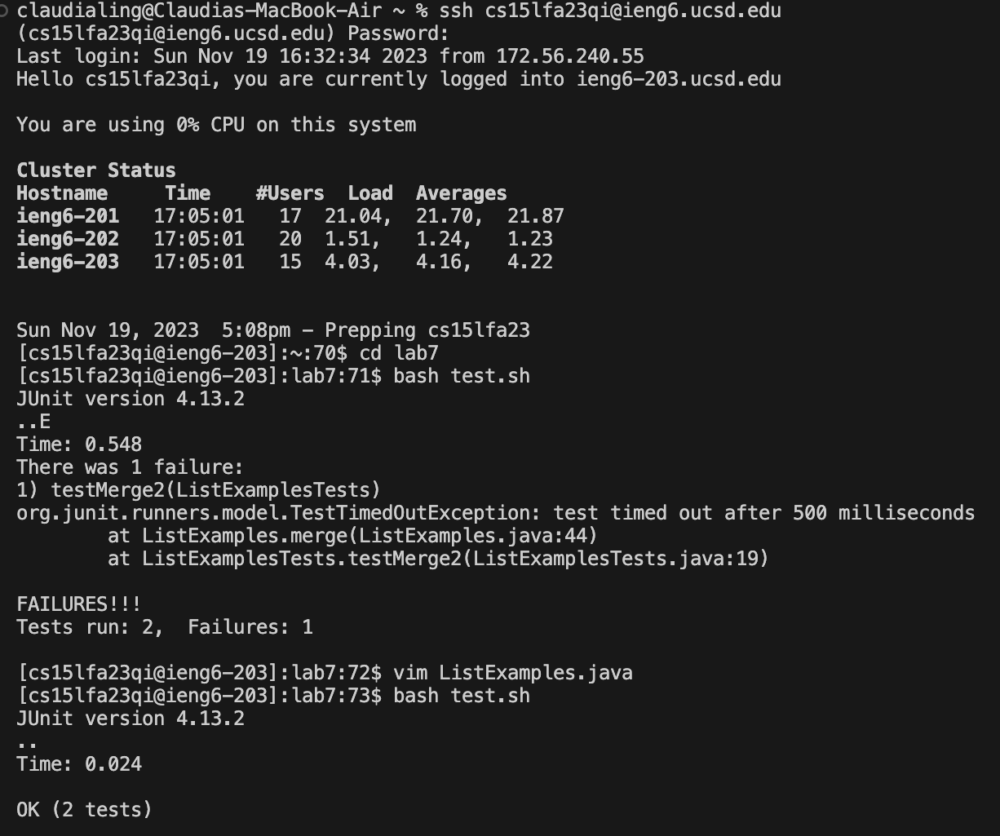

# Lab 4

  
 

Keys Pressed: 
~~~
ssh cs15lfa23qi@ieng6.ucsd.edu
~~~
This command is used to long into my ieng6 account.

~~~
cd lab7
~~~
This command is used to go in the directory of lab7.

~~~
bash test.sh
~~~
This command is used to run the test, demonstrating failure.

~~~
vim ListExamples.java
~~~
This command is used to use vim in the ListExamples code.

~~~
<shift>
?
1
<enter>
~~~
This vim command is used to search the code backwards, searching for "1" and is on the first occurence of "1".

~~~
n
r
2
~~~
The key "n" is used to find the next occurence in the forwards direction. The key "r" is used to replace what is under the cursor. The key "2" is the character that is being replaced under the cursor.

~~~
:
w
q
<enter>
~~~
The key "w" is used to save changes made to the code and the key "q" is use to quit the file it is in, so overall this command saves changes and quits the file. 

~~~
bash test.sh
~~~
This command is used to run the test, demonstrating that it passes with the new edited filed.

~~~
git add ListExamples.java
~~~
This command is used to stage the changes for the final commit.

~~~
git status
~~~
This command is used to see the current status of the working directory and staging area.

~~~
git commit
~~~
This command is used to save the changes to the local Git repository.
